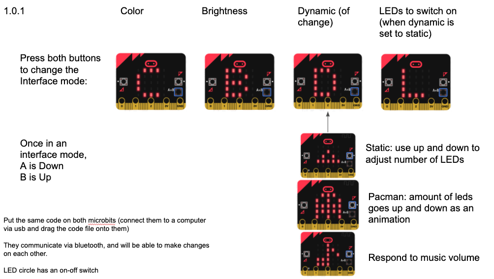

# microbit_ziphalo_sculpture_prototyping
code for microbit zip halo. Needs to work in https://makecode.microbit.org/#editor hence some code weirdness here and there.

[current manual is here](https://docs.google.com/presentation/d/1UgW4WmlRzD7S2L61QOMr-idsZHK6E32wnhnJt4vuXN8/edit?usp=sharing)

